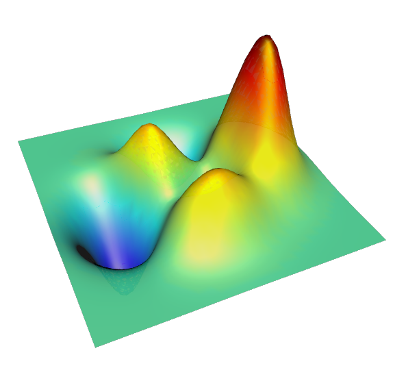

# matlab-to-html-plot-animated
Convert a matlab mesh to an interactive and animated 3D figure viewable in modern browsers

This script allows a deforming mesh to be exported to the web. The code creates html files in a subfolder called htmlfigs that can be opened in a browser.

The mesh can be rotated and zoomed in the browser, and transforms between two sets of input vertices.

Example of the output:
http://www.birving.com/other/Example2.html
(rotate the mesh to see if from a better angle)

See demo1.m and demo2.m to test it out.

This script creates html files that use the awesome x3dom library and require webgl. This is only supported by recent versions of chrome, firefox, opera and safari. IE does not support webgl.

Developed from:
http://www.mathworks.com/matlabcentral/fileexchange/40942-simple-3d-mesh-to-web-converter

Inspired by:
http://www.mathworks.com/matlabcentral/fileexchange/21944-animated-gif
